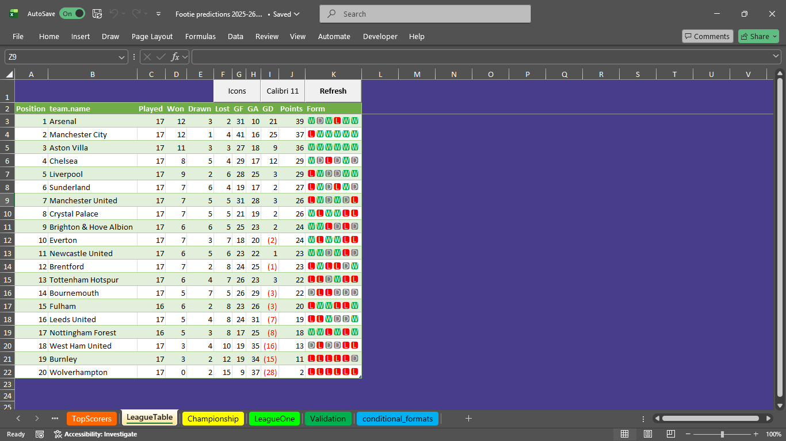
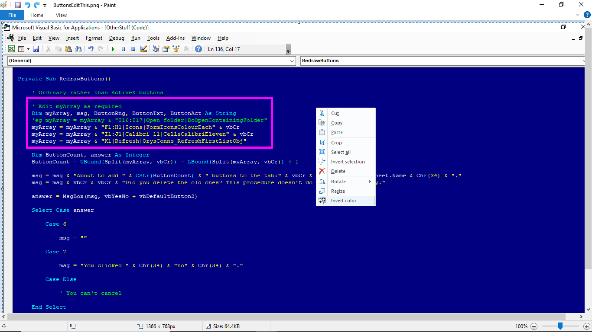

## I wrote this VBA procedure to keep my button edges tidy ☺
### Before

### After

### Instructions: Download the bas file, import to your spreadsheet, edit myArray, run the macro

### Image above with the colours inverted

### Note to self

 
 

What follows is for my benefit until I get the hang of editing README.md files:
# A first-level heading
## A second-level heading
### A third-level heading

# GitHub docs:

- [About README.md files](https://docs.github.com/en/repositories/managing-your-repositorys-settings-and-features/customizing-your-repository/about-readmes) 
- [Links](https://docs.github.com/en/get-started/writing-on-github/getting-started-with-writing-and-formatting-on-github/basic-writing-and-formatting-syntax#links) 
- [Images](https://docs.github.com/en/get-started/writing-on-github/getting-started-with-writing-and-formatting-on-github/basic-writing-and-formatting-syntax#images) 
- [Breaks](https://docs.github.com/en/get-started/writing-on-github/getting-started-with-writing-and-formatting-on-github/basic-writing-and-formatting-syntax#line-breaks) 
- [Lists](https://docs.github.com/en/get-started/writing-on-github/getting-started-with-writing-and-formatting-on-github/basic-writing-and-formatting-syntax#lists)
