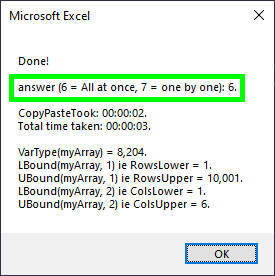
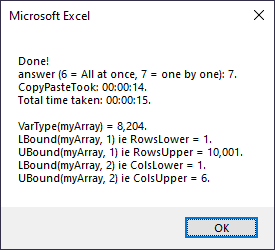

Question: How much quicker is it to dump an array to a worksheet in one go vs one cell at a time?

Answer: Much quicker!

Timings:

For my reference:

[Get started/Writing on GitHub/Start writing on GitHub/Basic formatting syntax](https://docs.github.com/en/get-started/writing-on-github/getting-started-with-writing-and-formatting-on-github/basic-writing-and-formatting-syntax)
