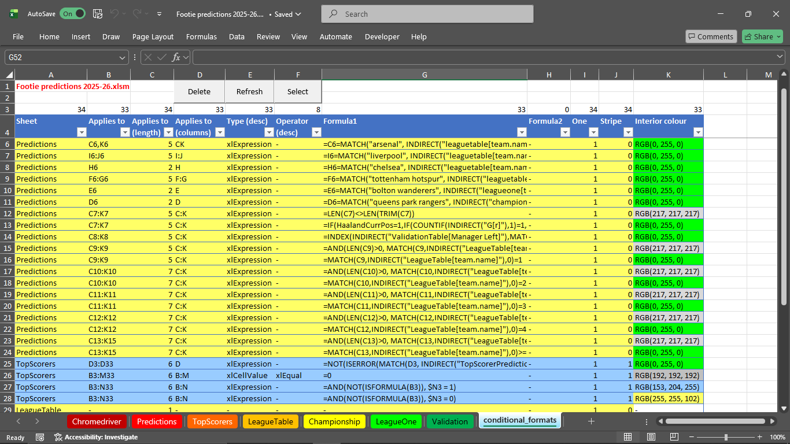

Exceptionally useful procedure that generates a report listing all the conditional formats in the ActiveWorkbook. Given I love a conditional format, I use this all the time. 

Report looks something like this:  

For my reference:

[Get started/Writing on GitHub/Start writing on GitHub/Basic formatting syntax](https://docs.github.com/en/get-started/writing-on-github/getting-started-with-writing-and-formatting-on-github/basic-writing-and-formatting-syntax)
