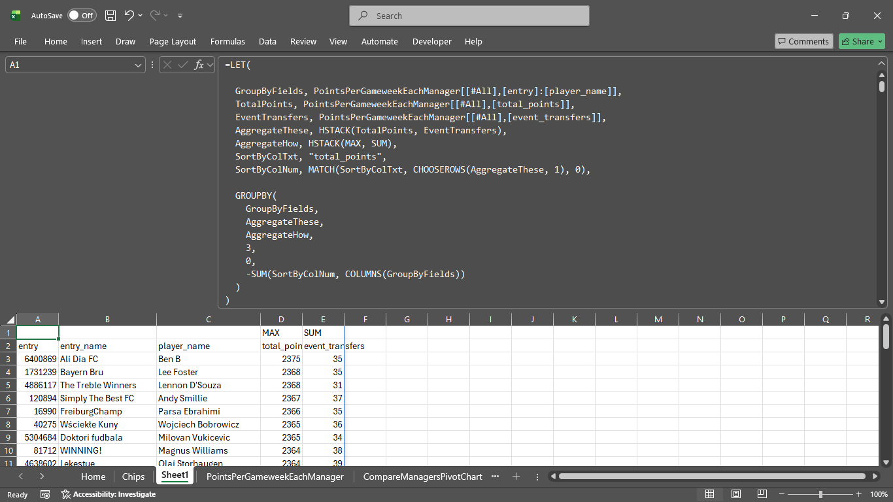
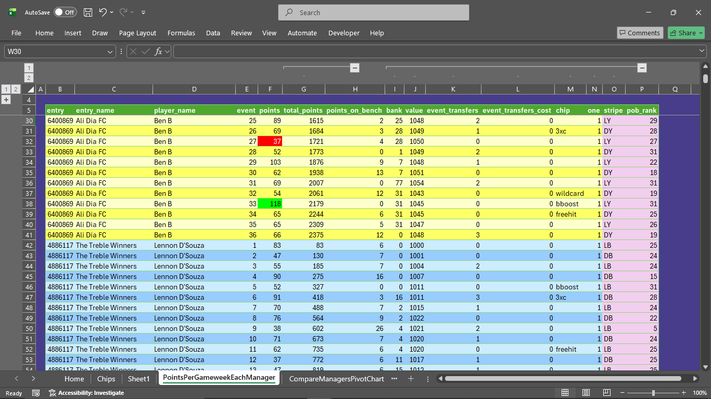

<a href="Formula.txt">Formula</a> to summarise (for example) the total number of transfers each manager has made throughout the season.

<!--  -->

For my reference:

[Get started/Writing on GitHub/Start writing on GitHub/Basic formatting syntax](https://docs.github.com/en/get-started/writing-on-github/getting-started-with-writing-and-formatting-on-github/basic-writing-and-formatting-syntax)

[void elements](https://www.w3.org/TR/2011/WD-html-markup-20110113/syntax.html)
