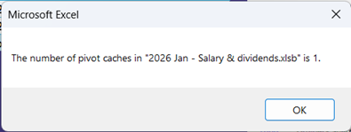
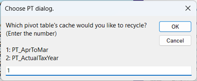
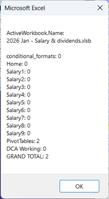

It's likely I'll be adding quite a lot of stuff to "PivotTables".

Tues 03 Feb 2026: I uploaded the file PivotTablesVBA_01.bas which contains the procedures:

  PTs__CachesCountActiveWB
  

  PTs_CacheRecycle
  

  PTs_CountEachTab
  

Also:

  PTs_SelectPTIncFilters & PTs_SelectPTExcFilters which do exactly what you would expect.
